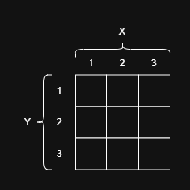
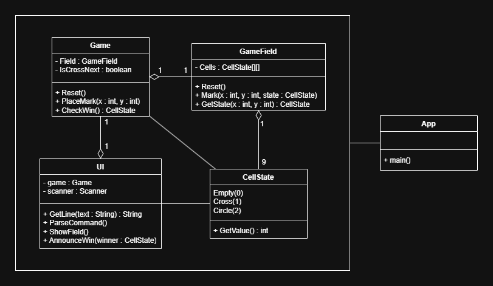

# Описание
Консольное приложение, написанное на языке Java для игры в "Крестики-нолики".
## Руководство
Для игры, необходимо запустить файл App.java. После запуска, будут предложены следующие команды:
- `exit` - выход из игры;
- `start` - начать игру.

После начала игры вы можете использовать команды:
- `stop` - остановить игру (вернуться в главное меню);
- `reset` - начать игру заново;
- `place` - сделать ход

Команда `place` сопровождается координатами хода (пример: `place 3 2`). Начало координат располагается в левом верхнем углу поля. Левая верхняя клетка имеет координаты (1, 1). Графически это выглядит так:

___
# Разработка
При разработке данного консольного приложения была составлена диаграмма классов:

На данной диаграмме:
- **App** - основная программа;
- **UI** - класс, представляющий интерфейс пользователя;
- **Game** - класс, представляющий саму игру;
- **GameField** - класс, представляющий игровое поле;
- **CellState** - перечисляемый тип (enum), описывающий состояние клетки поля.
___
# Разработчики
[IvanTheFox](https://github.com/IvanTheFox)
[JAM4I](https://github.com/JAM4I)
[zofix123](https://github.com/zofix123)
[Pizzaguyman](https://github.com/Pizzaguyman)